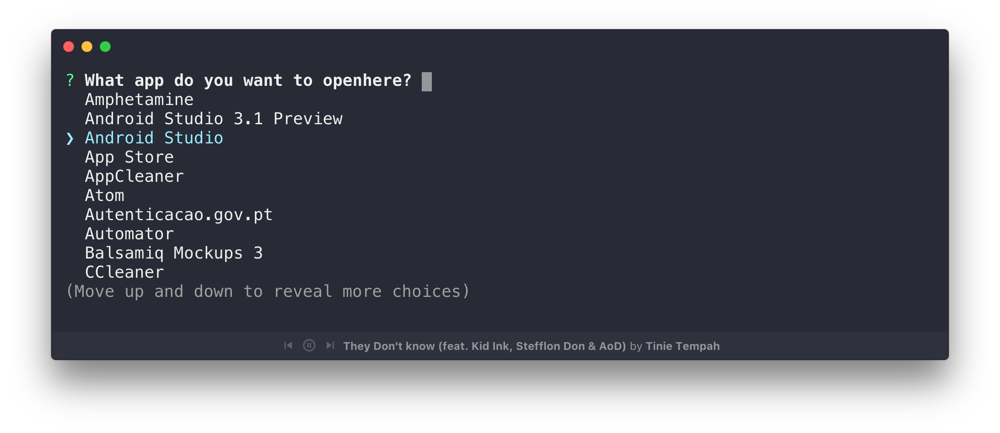

<h1 align="center">oh</h1>
<p align="center">Quickly <i>open</i> any app in the folder you're currently in</p>
<p align="center">
  <a href="https://travis-ci.org/cesarferreira/oh"></a>
  <a href="https://www.npmjs.com/package/oh"></a>
  <a href="https://www.npmjs.com/package/oh"></a>
  <a href="https://github.com/cesarferreira/oh/blob/master/LICENSE"></a>
</p>

<p align="center">
  
</p>

## Install

```sh
npm install -g oh-cli
```

## Usage
Run the command and enjoy the app being opened where you want it, I use it all the time for `Android Studio` and `Source Tree`

```
Usage
   $ oh
```

## Created by
[Cesar Ferreira](https://cesarferreira.com)

## License
MIT © [Cesar Ferreira](http://cesarferreira.com)
